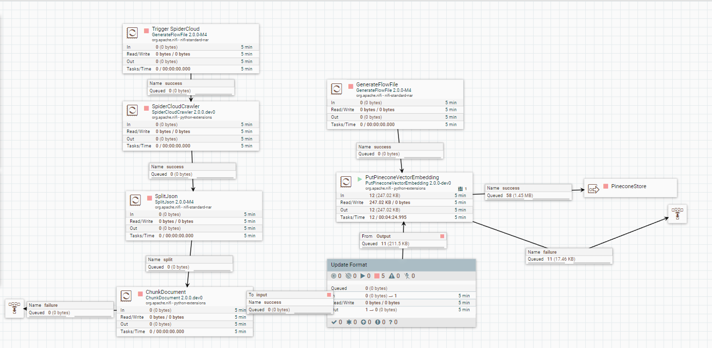

# NiFi Environment

## Prerequisites

- Docker Desktop: Ensure Docker Desktop is installed and running on your system.
- In the /infra/nifi you should install and add jython-standalone-2.7.2.jar and Python-3.11.9.tgz

## Setup and Running Instructions

1. Build the Docker Containers:
   - For Windows: `docker-compose build`
   - For Linux/MacOS: `docker compose build`
2. Start the Docker Containers:
   - For Windows: `docker-compose up -d`
   - For Linux/MacOS: `docker compose up -d`

## Access to the User Interface

- Username: orthlane
- Password : orthlane

## Adding new processors

- Add the new processors' folder to the folder `nifi-python-extensions extracted_extension/extension`
- Add to the Dockerfile this line: `chmod +x /opt/nifi/nifi-current/python_extensions/name_folder_processeur`

## Vector Embeddings Ingestion Pipeline

Document vector embedding pipeline for notes in Evernote is as follows:

The above flow was implemented with NiFi using the following flow:

Follow the below instructions to get this flow running:

1. Import the NiFi flow Vector_Embeddings_Ingestion_Pipeline onto the NiFi canvas

- Add the Process Group Icon located in top menu bar to the canvas

  

- Select the NiFi flow called Vector_Embeddings_Ingestion_Pipeline located under nifi-flow

  

- And Click add
