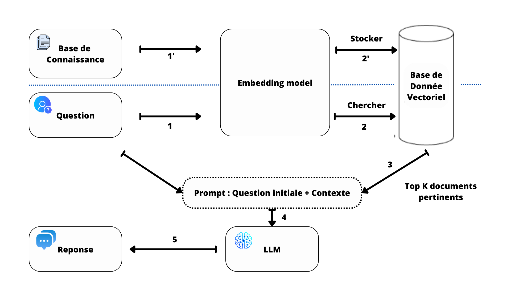
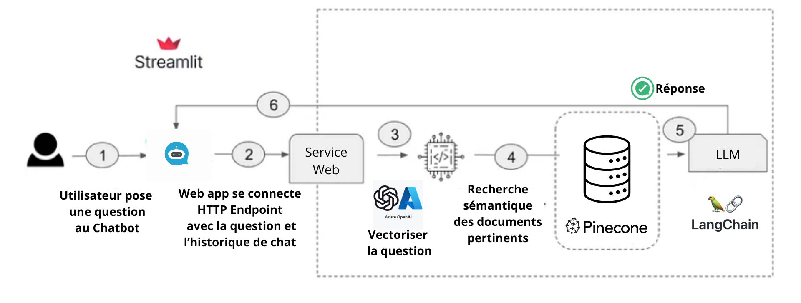
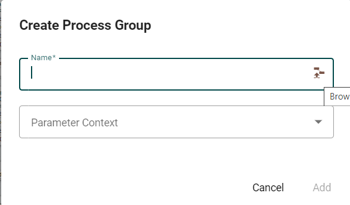

# Customized Chatbot Based on the RAG Method

## Project Objective

Orthlane aims to enhance its customer experience by developing an intelligent chatbot capable of quickly answering patients' questions using internal data (e.g., PDFs) and website information. This chatbot will be deployed on the website and treatment tracking platform, with the mission of providing personalized and efficient support. The main challenge is to keep data up to date while managing a large volume of documents and requests.

## Overall Architecture

The project's architecture uses workflow automation concepts. It is divided into two main pipelines:

1. **Data Storage Pipeline:** This automates database updates in response to changes on the Orthlane website or the publication of new research documents, ensuring the database is always up to date.
2. **Response Generation Pipeline:** This handles chatbot queries and responses, facilitating access to and processing the necessary data to provide accurate answers.



### Pipeline 1: Data Storage

This pipeline involves several key steps: first, data is collected from various sources. Then, the data is split into optimized segments (based on a specific number of tokens). Once segmented, the data is transformed into vectors, which are then stored in a vector database.


### Pipeline 2: Response Generation

In this flow, the web service endpoint receives the user’s query along with the conversation history from the chatbot interface built with Streamlit. First, vector embeddings are created from the user’s question. A semantic search is then performed in the Pinecone vector database to retrieve relevant knowledge. The results are integrated into a prompt, combining the retrieved documents, the user’s query, and the conversation history. This prompt is then passed to the Azure OpenAI LLM service to generate a relevant response, including sources from the knowledge base.



## Prerequisites

- **Docker Desktop:** Ensure Docker Desktop is installed and running on your system.
- In the `/infra/nifi` directory, install and add `jython-standalone-2.7.2.jar` and `Python-3.11.9.tgz`.
- **AzureOpenAi Key:**
- **SpiderCloud Key:**
- **Pinecone Api Key:**

## Adding New Processors

To add new processors, follow these steps:

1. Add the new processor folder to the following path: `/infra/nifi-python-extensions/extracted_extensions/extensions`.
2. Add this line to the `Dockerfile` to give execute permission to the processor folder:
   ```bash
   chmod +x /opt/nifi/nifi-current/python_extensions/name_folder_processor
   ```

This project has the following file structure:

```
.
.github
│   └───workflows
├───images
├───infra
│   ├───nifi
│   │   └─
│   ├───nifi-python-extensions
│   │   └───extracted_extensions
│   │       └───extensions
│   │           ├───chat
│   │           │
│   │           ├───chunking
│   │           │
│   │           ├───embeddings
│   │           │
│   │           ├───getresponse
│   │           │
│   │           ├───scrapping
│   │           │
│   │           └───vectorstores
│   │
│   ├───nifi-registry
│   │      └─
│   └───streamlit
└───nifi-flow
.
```

## Setup and Running Instructions

1. Build & Start the Docker Containers:
   ```
   docker compose -f infra/docker-compose.yml up -d --build
   ```

## Access to the User Interface

- Username: nifi
- Password : nifi2024

Follow the below instructions to get this flow running:

1. Import the NiFi flow Chatbot.json onto the NiFi canvas

- Add the Process Group Icon located in top menu bar to the canvas

  

- Select the NiFi flow called Chatbot located under nifi-flow

  

- And Click add

### Data Storage Pipeline:


The NiFi flow presented consists of three main stages:

Web Scraping: This first framework is responsible for web scraping, extracting data from various websites. It automates the process of fetching relevant content, ensuring that the data collected is up to date.

PDF Parsing: The second framework parses PDF files and another files types if you want, extracting structured information from these documents. This step processes the internal documents, transforming them into a usable format for further analysis.

Data Ingestion into Pinecone: Finally, the third framework ingests the extracted data into Pinecone, a vector database. This allows for efficient storage and retrieval, optimizing the way the information is stored and processed for semantic searches and other AI-driven tasks.

### Response Generation Pipeline


This flow ensures seamless interaction between the user interface (frontend) and the backend system. The user's question is processed, a response is generated via a language model, and the response is returned for display quickly and efficiently.

## Result


